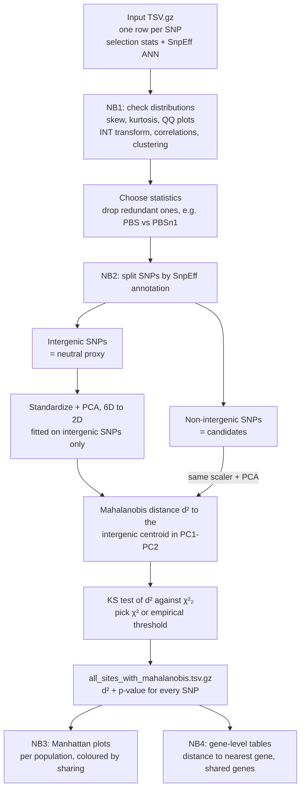

# MDS-sel: finding selection outliers with multidimensional scaling

MDS-sel is a multidimensional scaling-based approach that finds SNPs that look like targets of positive selection by combining **several selection statistics into one test**.

It does not rank SNPs on a single statistic (PBS, iHS, XP-EHH, …), instead it:

1. builds a **neutral reference cloud** from intergenic SNPs in a low-dimensional space computed from all the statistics together,
2. **projects every other SNP (non-intergenic)** into that same space,
3. gives each SNP a **Mahalanobis distance** to the neutral cloud and a p-value,
4. summarises the hits as **Manhattan plots** and **gene tables shared across populations**.

The pipeline is four Jupyter notebooks, meant to be run in order.


---

## Contents

- [Why a multivariate approach?](#why-a-multivariate-approach)
- [Method overview](#method-overview)
- [Input format](#input-format)
- [Installation](#installation)
- [Running the pipeline](#running-the-pipeline)
  - [1. Normalization and clustering](#1-normalization-and-clustering)
  - [2. Dimensionality reduction and Mahalanobis outliers](#2-dimensionality-reduction-and-mahalanobis-outliers)
  - [3. Manhattan plots](#3-manhattan-plots)
  - [4. Gene tables](#4-gene-tables)
- [Outputs](#outputs)
- [How to interpret the results](#how-to-interpret-the-results)
- [Assumptions, caveats and known limitations](#assumptions-caveats-and-known-limitations)
- [Example run (Lhasa, Raute, Dailekh)](#example-run-lhasa-raute-dailekh)
- [Citation](#citation)

---

## Why a multivariate approach?

Each selection statistic picks up a different signature of selection:

| Statistic | What it detects | Signal type |
|---|---|---|
| **PBS / PBSn1** (Population Branch Statistic, normalized) | Allele-frequency differences unique to the focal population | Differentiation (F<sub>ST</sub>-based) |
| **PBE** (Population Branch Excess) | PBS signal beyond what the outgroups show | Differentiation |
| **iHS** (`normihs`) | Long haplotypes around an allele within one population, from an incomplete sweep | Haplotype homozygosity |
| **nSL** (`normnsl`) | Like iHS, but measured in number of SNPs, so it is less sensitive to recombination-map errors | Haplotype homozygosity |
| **XP-EHH** (`normxpehh`) | Haplotype homozygosity in the focal population compared with a reference population, for complete or near-complete sweeps | Cross-population haplotype |
| **XP-nSL** (`normxpnsl`) | The cross-population version of nSL | Cross-population haplotype |

A true sweep usually leaves a moderate signal in **several** statistics, not an extreme value in just one. Single-statistic outlier scans have two problems:

- they **miss** loci where several statistics are high but none passes its own cutoff, due to their specification to different demographic models;
- their results are **redundant** because the statistics are correlated (for example PBS and PBSn1, or iHS and nSL).

MDS-sel treats every SNP as a point in a multi-dimensional space of statistics. It then asks one question: **how far is this SNP from where neutral SNPs sit in that space?** Correlations between statistics are handled by the covariance matrix, so a signal is not counted twice.

---

## Method overview


**1. Neutral reference.** SNPs whose first SnpEff annotation is `intergenic_region` are used as the empirical neutral background. Their combined distribution of statistics approximates what drift and demography produce without selection.

**2. Standardization.** Every statistic is z-scored with the intergenic mean and standard deviation (`sklearn.preprocessing.StandardScaler`). This puts the statistics on a common scale; otherwise PBS (around 10⁻²) and iHS (around 1) would carry very different weight.

**3. PCA, multi-D to 2D.** A 2-component PCA is fitted **on intergenic SNPs only**. PC1 and PC2 are the two main axes of neutral co-variation among the statistics. All other SNPs are then projected with the *same* scaler and PCA, so the reference frame does not move. This creates a countour of values from the center of the distribution. 

**4. Mahalanobis distance.** In the 2D space, with intergenic centroid **μ** and covariance **Σ**:

```
d²(x) = (x − μ)ᵀ Σ⁻¹ (x − μ)
```

This is a distance that accounts for scale and correlation: it measures how unusual a point is *given the shape* of the neutral cloud. If the neutral cloud is bivariate Gaussian, `d² ~ χ²` with 2 degrees of freedom.

**5. Calibration.** A Kolmogorov–Smirnov test compares the intergenic `d²` values with χ²₂:

- **KS statistic ≤ 0.03**: the Gaussian approximation is acceptable, and the threshold is `χ²₂` quantile at the chosen level (`method = "chi2"`).
- **KS statistic > 0.03**: the neutral cloud is not Gaussian enough, and the threshold is the **empirical quantile** of intergenic `d²` (`method = "empirical"`).

Why using a KS *statistic*? In whole genome sequences, 100Ks of SNPs are represented. In this context the p-value is 0, so it cannot be used to detect distances.

**6. Outliers.** Non-intergenic SNPs with `d²` above the threshold lie outside the neutral contour and are the **candidate selected variants**.

**7. Enrichment check.** If selection affects genic regions, genic SNPs should be **over-represented in the extreme tail** compared with intergenic SNPs. The notebook reports:
- a Mann–Whitney U test (genic vs. intergenic `d²`);
- the **odds ratio of genic enrichment** across a range of tail probabilities (OR > 1 means genic SNPs are enriched).

---

## Input format

One gzipped, tab-separated file **per population**, with one row per SNP ("dataset.nonan.tsv.gz"). These statistics are orientative; any other selection statistics can be used. To generate this file, we ran selscan v2.1 on a set of phased genomes in VCF and clustered all values together. 

```
chr   pos      ref  alt  PBS       PBSn1     PBE       normihs   critihs  normnsl   critnsl  normxpehh  critxpehh  normxpnsl  critxpnsl  info
chr1  914060   C    T    -0.0381   -0.0335   -0.0697   -1.28397  0        -0.710961 0        -0.0770566 0          0.166566   0          BaseQRankSum=...;ANN=T|upstream_gene_variant|MODIFIER|RP11-54O7.2|...
```

**Requirements:**
- **No missing values** in the statistic columns (rows with NaN are dropped). The `*.nonan.tsv.gz` naming shows this filter has already been applied.
- The `ANN=` field must follow the standard SnpEff layout `Allele|Effect|Impact|Gene_Name|Gene_ID|…`. The pipeline reads field 2 (**effect**, e.g. `intergenic_region`) and field 4 (**gene name**).
- The Jupyter notebook can be modified to be used with other column names. All column names must be separate, tab-delimited columns.

Gene-level annotation in notebook 4 also needs a **GENCODE GTF**. The example used `gencode.v43.annotation.gtf.gz` (GRCh38 in humans), and the GTF must match your reference build.

---

## Installation

Python ≥ 3.9.

```bash
conda create -n mds-sel python=3.11
conda activate mds-sel
pip install numpy pandas scipy scikit-learn matplotlib seaborn polars pyarrow pyranges jupyterlab
```
**Memory:** full genome-wide files (about 1.3 M SNPs × 16 columns plus the long `info` strings) need roughly **8–16 GB RAM**. On an HPC cluster, run Jupyter on a compute node, not a login node. This can be used in a commercial laptop. 

---

## Running the pipeline

Put the input `.tsv.gz` files (and the GTF for NB4) in the same directory as the notebooks, then run them **in order**. Each notebook has a **`CONFIG`** cell at the top. That cell is usually the only thing you need to edit.

### 1. Normalization and clustering

`1.normalization_clustering.ipynb`

**Purpose:** exploratory checks to decide which statistics to put into the multivariate model.

**What it does:**
- For each statistic, reports N, mean, SD, skewness and excess kurtosis, plus Shapiro–Wilk (on a 5,000-SNP subsample) and D'Agostino K² (on a 100,000-SNP subsample) normality tests.
- Saves a histogram and Q-Q plot per statistic.
- Applies a **rank-based inverse normal transform (INT)**, `Φ⁻¹((rank − 0.5)/N)` to normalize all statistics and repeats the diagnostics.
- Computes the **Pearson correlation matrix** of the INT statistics, draws a heatmap, and clusters the statistics hierarchically using distance `1 − |r|` with average linkage.

**How to use the output:** look for statistics that are almost duplicates (high |r|, joined at the bottom of the dendrogram). Keep one from each tight cluster. For example, **PBS was dropped in favour of PBSn1** since they coincided in a 90%. 

**Config:**
```python
FILENAME   = "dataset.nonan.tsv.gz"
STATS_COLS = ["PBS", "PBSn1", "PBE", "normihs", "normnsl", "normxpehh", "normxpnsl"]
```

**Outputs:** `normality_plots/*.png`, `RAW_distribution_statistics.tsv`, `INT_distribution_statistics.tsv`, `INT_correlations.tsv`, `INT_heatmap.png`, `INT_cladogram.png`.


### 2. Dimensionality reduction and Mahalanobis outliers

`2.dim_reduction.PCA_Mahalanobis.ipynb`

**Purpose:** the core of the method. Run it **once per population**.

**Config:**
```python
FILENAME   = "dataset.nonan.tsv.gz"   # change per population
STATS_COLS = ["PBSn1", "PBE", "normihs", "normnsl", "normxpehh", "normxpnsl"]
threshold  = 0.99                           # neutral quantile used to call outliers
```

**What it does:**
1. Loads the statistics and `info`, and splits SNPs into **intergenic** and **non-intergenic** using the first `ANN` effect.
2. Fits `StandardScaler` and a 2-component PCA on intergenic SNPs, then projects the non-intergenic SNPs into that same space.
3. Computes Mahalanobis `d²` for every SNP and runs the KS calibration described above (χ² or empirical threshold).
4. Produces four diagnostic figures:
   - **PCA projection** — intergenic in black, genic in red, a KDE contour of the neutral cloud, and the threshold ellipse.
   - **Distance distribution** — histograms of intergenic and genic `d²` with the χ² (or empirical KDE) reference curve and the threshold line.
   - **χ² Q-Q diagnostic** — observed `d²` against expected χ²₂ quantiles. Genic points lifting above the diagonal in the upper tail is the signal you want to see.
   - **Genic enrichment vs. threshold** — odds ratio across tail probabilities.
5. Reports the Mann–Whitney U p-value for genic vs. intergenic `d²`.
6. Writes the outlier table and the full annotated table.

**Outputs:**

| File | Contents |
|---|---|
| `all_sites_with_mahalanobis.tsv.gz` | **The main result.** The input file with `mahalanobis_d2` and `p_value` columns appended, for every SNP. |
| `non_intergenic_outside_<method>_contour.pval_<p>.tsv.gz` | Only the genic outliers above the threshold. |
| `non_intergenic_snps.pkl` | Cached genic statistics matrix. |
| `PCA_projection_intergenic_space.pval_<p>.png`, `Mahalanobis_distance_comparison.pval_<p>.png`, `Mahalanobis_QQ_comparison.pval_<p>.png`, `genic_enrichment_vs_threshold.png` | Figures. |

> **Rename the output per population before moving on.** Notebooks 3 and 4 expect files named like `dataset.all_sites_with_mahalanobis.tsv.gz`, with a population prefix. The notebook always writes the generic `all_sites_with_mahalanobis.tsv.gz`, so the second population would overwrite the first.

### 3. Manhattan plots

`3.manhattan.plot.ipynb`

**Purpose:** genome-wide visualization across populations.

**Config:**
```python
files = {
    "pop1":   "pop1.all_sites_with_mahalanobis.tsv.gz",
    "pop2":   "pop2.all_sites_with_mahalanobis.tsv.gz",
    "pop3":   "pop3.all_sites_with_mahalanobis.tsv.gz",
}
thresholds    = {"1e3": 1e-3, "1e4": 1e-4, "1e5": 1e-5, "1e6": 1e-6}
peak_distance = 50000   # minimum bp between two gene labels
```

**What it does:**
- Loads each file with polars, strips the `chr` prefix, keeps autosomes 1–22, floors `p_value` at `1e-20`, and computes `logp = −log10(p)`.
- Builds cumulative genome coordinates so chromosomes sit side by side.
- Parses **all** gene names from the `ANN` field (field 4 of every comma-separated annotation), not just the first.
- Draws one stacked panel per population, with every 5th SNP as grey/black background.
- **Colours significant SNPs by cross-population sharing** — red for a gene hit in 1 population, light blue for 2, dark blue for 3.
- Caps the y-axis at `−log10(p) = 22`; SNPs above the cap are drawn as black triangles at the cap and their labels get an `↑`.
- Labels the top 25 genes per panel as `GENE (n_hits) (g|i)`, where `(g)` is genic and `(i)` intergenic, keeping labels at least `peak_distance` bp apart.
- Repeats the whole figure for each threshold.

**Output:** `manhattan_<label>.55.50000.svg`, one per threshold.

### 4. Gene tables

`4.manhattan.tables.ipynb`

**Purpose:** turn SNP hits into gene-level tables, with distance to the nearest gene and cross-population sharing.

**Config:** same `files` and `thresholds` as NB3, plus the GENCODE GTF path. Note `p_value` is floored at `1e-50` here rather than `1e-20`.

**What it does:**
1. Loads the per-population tables as in NB3.
2. Reads gene bodies from the GTF with pyranges (`load_gene_bodies`); `load_genes_tss` is also provided if you prefer distance to the transcription start site instead.
3. For each intergenic SNP, finds the **nearest gene and its distance in bp** by `searchsorted` on sorted gene starts, checking the gene to the left and to the right. Genic SNPs get `distance_to_gene = 0` and their own gene as `nearest_gene`.
4. Writes a **per-population gene summary** with `n_hits`, min/mean/max `logp`, distance to the nearest gene, and min/mean/max of each selection statistic — so you can see *which* statistics drove each hit.
5. Writes a **cross-population summary** keeping only genes significant in **≥ 2 populations**, sorted by `logp_max`.

**Outputs:**

| File | Contents |
|---|---|
| `gene_summary_dist_<label>.tsv` | Per population and gene: hit counts, logp range, distances, and per-statistic min/mean/max. |
| `shared_genes_<label>.2.tsv` | Genes significant in ≥ 2 populations: `populations`, `n_pops`, `logp_max`, `logp_mean`, `chromosome`, `nearest_gene`, `n_shared_snps`. |

> Both notebooks 3 and 4 **re-run `chr` normalization in place**. NB4 strips the prefix at load, then adds it back before the pyranges step to match GENCODE's `chr1` naming. If you re-run cells out of order you can end up with `chrchr1`. Restart the kernel and run top to bottom if the nearest-gene columns come back empty.

---

## Outputs

```
MDS-sel/
├── normality_plots/                                  # NB1 histograms + QQ plots
├── RAW_distribution_statistics.tsv                   # NB1
├── INT_distribution_statistics.tsv                   # NB1
├── INT_correlations.tsv, INT_heatmap.png             # NB1
├── INT_cladogram.png                                 # NB1
├── <pop>.all_sites_with_mahalanobis.tsv.gz           # NB2  ← main per-population result
├── non_intergenic_outside_*_contour.pval_*.tsv.gz    # NB2  outliers only
├── PCA_projection_intergenic_space.pval_*.png        # NB2
├── Mahalanobis_distance_comparison.pval_*.png        # NB2
├── Mahalanobis_QQ_comparison.pval_*.png              # NB2
├── genic_enrichment_vs_threshold.png                 # NB2
├── manhattan_1e{3,4,5,6}.*.svg                       # NB3
├── gene_summary_dist_1e{3,4,5,6}.tsv                 # NB4
└── shared_genes_1e{3,4,5,6}.2.tsv                    # NB4  ← cross-population candidates
```

---

## How to interpret the results

**Read the diagnostics before the hit list.**

1. **PC1 and PC2 variance.** In the example run, PC1 = 38.3% and PC2 = 32.2%, so 2 components hold about 71% of the variance in 6 statistics. If your PC1 and PC2 explain much less, the statistics are close to independent and 2D is discarding real signal. Consider more components (`n_components`, and matching `df` in the χ² calls) or analysing the signal classes separately.

2. **KS statistic.** Below 0.03 you can read the p-values as χ² tail probabilities. Above it the method falls back to empirical quantiles and the p-values become a ranking score only.

3. **Q-Q plot.** Intergenic points should track the diagonal. Genic points lifting above the diagonal in the upper tail is the multivariate excess that selection would produce.

4. **Odds ratio curve.** OR > 1, rising towards the extreme tail, says the outliers are enriched for genic SNPs — evidence the signal is biological rather than a technical artefact. OR near 1 means your outliers are not distinguishable from the neutral background, and the hit list should not be trusted.

5. **Then the hits.** `shared_genes_*.tsv` is the most informative table: a gene passing the threshold in several populations independently is the strongest candidate. Use `gene_summary_dist_*.tsv` to see which statistics drove it — a hit resting on `PBSn1` alone is a differentiation signal, while one with high `normxpehh` and `normnsl` is a haplotype-structure signal.

**Threshold choice.** Four thresholds (1e-3 to 1e-6) are reported so you can see how fast the hit list shrinks. In the example, shared genes went 374 → 75 → 14 → 5. A signal that survives to 1e-6 is robust; one that only appears at 1e-3 needs independent support.

---

## Assumptions, caveats and known limitations

**Intergenic SNPs are a proxy for neutrality, not neutrality itself.** They include enhancers, lncRNAs and conserved non-coding elements, all of which can be under selection. This makes the neutral cloud slightly too wide, so the method is **conservative** — some real signals are missed. If you want a stricter background, restrict to intergenic SNPs that are also far from any gene and have low phyloP/phastCons scores.

**Genic and intergenic SNPs differ in more than selection.** They differ in mutation rate, GC content, recombination rate and SNP density. Part of the genic enrichment in the tail may reflect those differences rather than selection. Treat the odds-ratio curve as supporting evidence, not proof.

**Only the first annotation decides intergenic status in notebook 2.** `extract_effect` reads `ANN=` field 2 of the **first** comma-separated annotation. Notebook 3's `get_region_type` is different: it scans **all** annotations and calls a SNP intergenic if any of them says so. So the genic/intergenic split in NB2 and the `region_type` column in NB3/NB4 are not guaranteed to agree for multi-annotation SNPs.

**P-values are per SNP, with no multiple-testing correction and no LD handling.** Neighbouring SNPs in the same haplotype are not independent, so a single sweep produces many correlated hits. `n_hits` per gene is a count of correlated SNPs, not independent evidence. The gene labels in NB3 and the `peak_distance` filter mitigate this visually but do not correct the statistics.

**The statistics must already be normalized consistently across populations.** `normihs`, `normnsl`, `normxpehh` and `normxpnsl` are expected to be allele-frequency-binned normalized values (as produced by selscan's `norm`). If populations were normalized with different bin schemes or reference panels, cross-population comparisons in NB3 and NB4 are not valid.

**XP-EHH and XP-nSL depend on the reference population.** The choice of reference determines what a "high" cross-population score means, so document it alongside your results.

**Sample sizes are small.** The example populations have 14, 16 and 28 individuals. Haplotype statistics are noisy at this depth, and PBS is sensitive to sampling error in allele-frequency estimates.

**No sex chromosomes.** Notebooks 3 and 4 filter to autosomes 1–22.

**Missing values are dropped, not imputed.** Any SNP with NaN in any statistic is removed from the analysis entirely. Check how many SNPs this costs before interpreting coverage.

**Reproducibility.** `np.random.seed(42)` is set in notebooks 1 and 2, which fixes the plotting and normality-test subsamples. The PCA is also seeded. Notebooks 3 and 4 do not subsample, so they are deterministic.

---

## Example run (Lhasa, Raute, Dailekh)

Three Nepali and Tibetan populations, GRCh38, SnpEff-annotated, GENCODE v43.

**Notebook 1** on `28lha_merged.nonan.tsv.gz` — 1,322,911 SNPs. All raw statistics rejected normality, as expected at this N. The informative numbers were the shape statistics: PBS was strongly leptokurtic (skew 1.00, excess kurtosis 10.38) and PBE moderately so (kurtosis 5.61), while the four haplotype statistics were close to normal (|skew| ≤ 0.49, kurtosis ≤ 0.89). After the INT transform every statistic had mean 0, SD 1, skew 0 and kurtosis ≈ 0 by construction. On the basis of the correlation structure, **PBS was dropped and PBSn1 kept**.

**Notebook 2** on `14rau_merged.nonan.tsv.gz` — 463,216 intergenic and 726,175 non-intergenic SNPs with complete data. PCA on the intergenic set gave **PC1 = 38.3%, PC2 = 32.2%** (71.6% in 2D). The KS statistic against χ²₂ was **0.044**, above the 0.03 cutoff, so the **empirical** threshold was used: at the 99% neutral quantile, `d² > 11.4451`, giving **7,327 genic outliers**. Mann–Whitney on genic vs. intergenic `d²` gave **p = 3.4 × 10⁻¹⁶**, confirming the genic distribution is shifted. The exported table held 1,189,391 SNPs with no missing `mahalanobis_d2`.

**Notebook 4** across all three populations, genes significant in ≥ 2 populations:

| Threshold | Shared genes |
|---|---|
| 1e-3 | 374 |
| 1e-4 | 75 |
| 1e-5 | 14 |
| 1e-6 | 5 |

Note that this run used the empirical threshold, so those p-values rank SNPs rather than calibrate them.

---

## Citation

If you use this method, please cite the publication associated with this repository, together with the tools that produce the input statistics — **selscan** (Szpiech & Hernandez) for iHS, nSL, XP-EHH and XP-nSL, and **SnpEff** (Cingolani et al.) for annotation.

---

## Contact

Open an issue in this repository for questions or problems.
